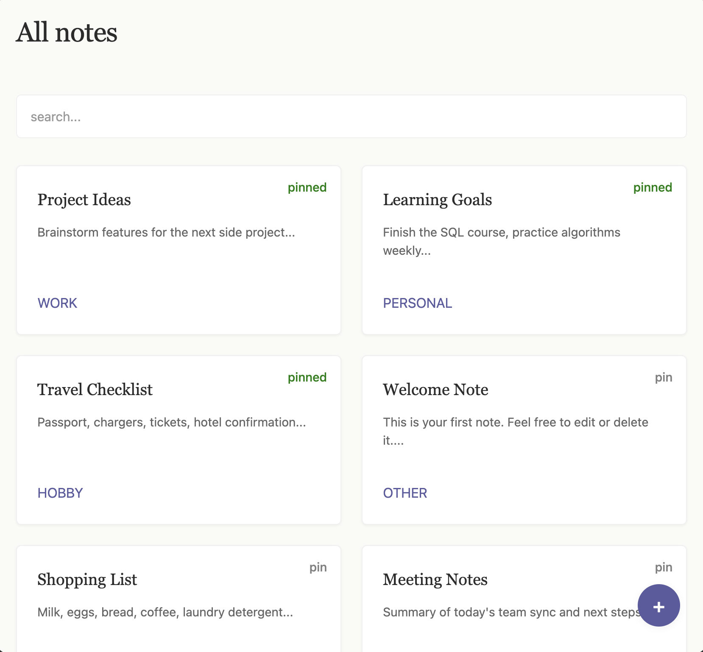

# SeggiNote

A fullstack note-taking application built with React and Spring Boot.
Focused on clean frontend design with a paper notebook aesthetic and seamless backend integration.
Fully containerized with Docker.

## What does the project do?

SeggiNote is a minimal, elegant note-taking app that demonstrates modern fullstack development:

**The Flow:**

1. User creates/edits notes in the React frontend
2. Frontend sends requests via Axios to the REST API
3. Backend processes and persists data to MySQL
4. Frontend displays notes with a clean, paper-inspired UI

Simple. Clean. Works.

## Technology

**Frontend:**

- React.js (Vite)
- Axios (HTTP Client)
- CSS (Paper notebook style with glassmorphism)
- React Router DOM

**Backend:**

- Java Spring Boot
- Spring Data JPA
- MySQL Database

**Infrastructure:**

- Docker & Docker Compose (FE, BE, DB in one command)

## Architecture

```
Frontend (Port 3000) - React UI
└── Components: NotesPage, NoteCard, NoteDetailPage
└── Axios Client → http://localhost:8080/api/v1

Backend (Port 8080) - Spring Boot REST API
└── Controllers: NoteController
└── Services: NoteService (business logic)
└── Repository: NoteRepository (JPA)

Database (Port 3306) - MySQL
└── Table: note (id, title, content, tag)
```

## Installation

### 1. Clone Repository

```bash
git clone https://github.com/DamiSeggi/SeggiNote.git
cd SeggiNote
```

### 2. Create .env File

Before running Docker, create a `.env` file in the **project root** (same level as `docker-compose.yml`):

```bash
touch .env
```

Add these credentials to `.env`:

```
MYSQL_ROOT_PASSWORD=rootpassword
MYSQL_DATABASE=segginote
MYSQL_USER=seggiuser
MYSQL_PASSWORD=seggipass

SPRING_DATASOURCE_USERNAME=seggiuser
SPRING_DATASOURCE_PASSWORD=seggipass
SPRING_JPA_HIBERNATE_DDL_AUTO=update
```

### 3. Start with Docker

```bash
docker-compose up --build
```

- **Frontend:** `http://localhost:3000`
- **Backend:** `http://localhost:8080`
- **Database:** `localhost:3306`
- **Swagger UI** `http://localhost:8080/swagger-ui/index.html`

Everything runs in isolated containers. Database is automatically created.

## Features

**Frontend:**

- Create, read, update, delete notes
- Paper notebook aesthetic (clean, minimal design)
- Responsive grid layout
- Smooth transitions and hover effects
- Modal dialog for creating notes

**Backend:**

- RESTful API for note management
- JPA entity mapping
- Database persistence
- Auto-schema generation via Hibernate

## What I learned / Improved

- React component architecture
- Axios for API communication
- REST API design with Spring Boot
- JPA/Hibernate for database persistence
- Clean separation of concerns (Frontend ↔ Backend ↔ Database)
- Containerizing applications with Docker and Docker Compose

## Preview

